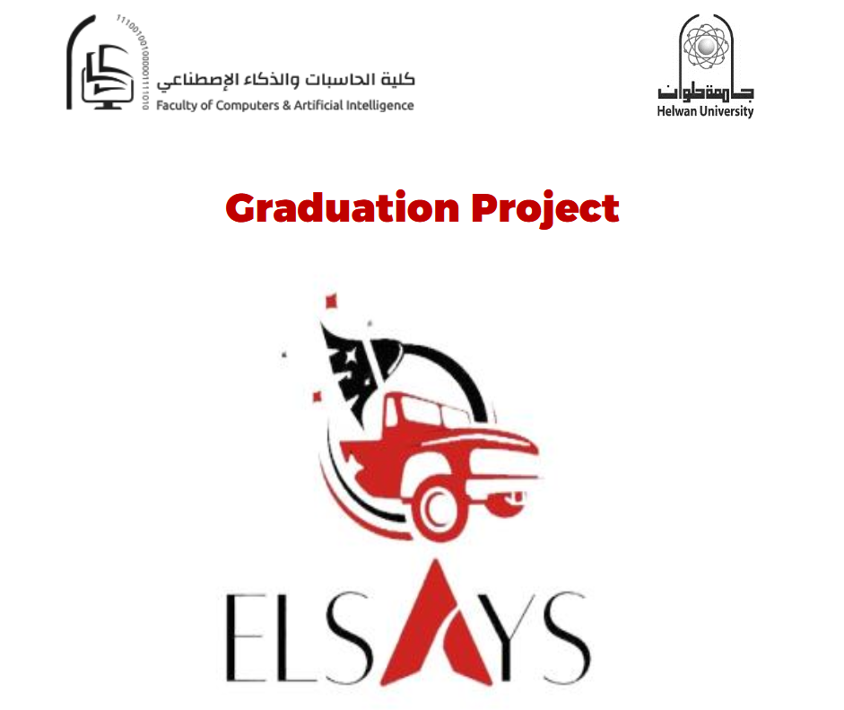

# Elsays 🚗

Elsays is a mobile platform that enables customers to reserve parking spaces and request vehicle-related services while visiting malls and hotels. The platform combines parking management, vehicle care services, and electronic payments into a unified customer experience.

---

## Project Poster 🎓

---

## Project Documentation 📘

A complete project documentation package is available below, including project objectives, requirements analysis, system design, implementation details, testing activities, and project outcomes.

📄 [Elsays Project Documentation](docs/specifications/elsays-project-documentation.pdf)
